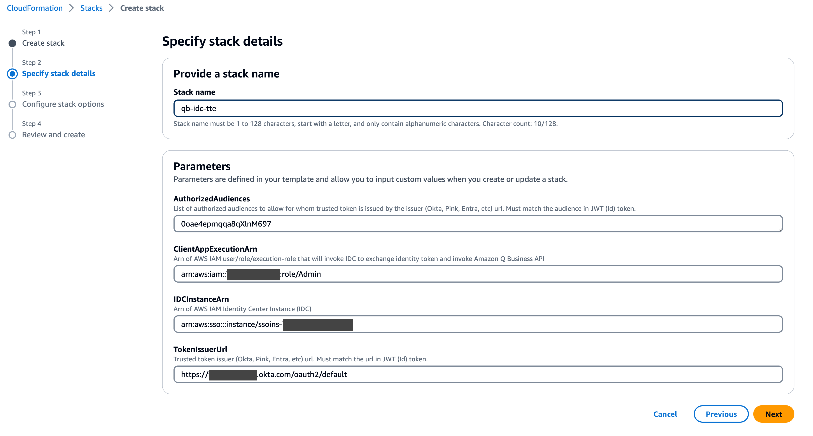
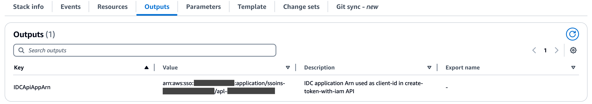
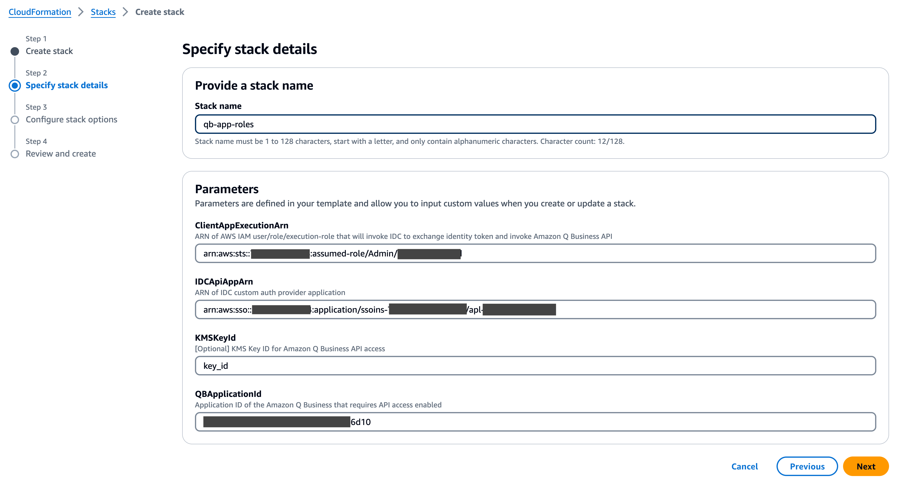
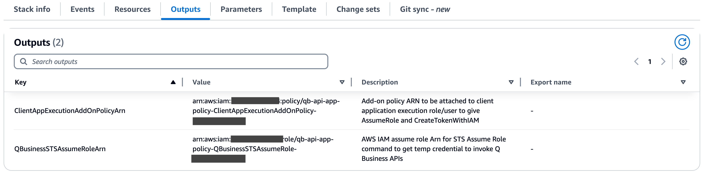
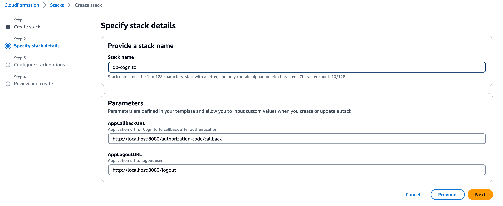
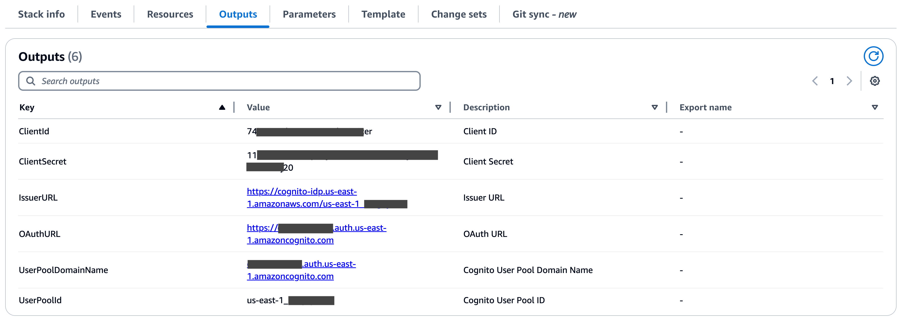

# AWS CloudFormation templates to automate trusted token issuer configuration for your application

You can leverage the AWS CloudFormation templates to automate configuration of trusted token issuer in AWS IAM Identity Center for your application. A brief description of the templates are as follows.

## Template for configuring AWS IAM Identity Center [qb-api-idc-config.yaml]
You can use this CloudFormation template to automate configuration of trusted token issuer in your IAM Identity Center. **_Deploy this stack in the AWS account where your IAM Identity center instance, used by your application, is located_**. This could be 1/ in the same AWS account where your application is deployed as a standalone or account instance, or 2/ could be in a shared central AWS account managed as part of AWS Organization.

### Stack Input

The template takes 4 parameters:  
1/ **IDCInstanceArn:** The instance ARN of the IAM Identity Center instance used by your application.  
2/ **ClientAppExecutionArn:** The ARN of IAM user, group or execution role that is used for running your application that will invoke IAM Identity Center for token exchange and AWS STS service for generating temporary credential. For example, this could be the Execution Role ARN of AWS Lambda where you code is executed.  
3/ **TokenIssuerUrl:** The URL of the trusted token issuer. Trusted token issuer is a third party identity provider that will authenticate a user and generate a ID token for authorization purposes. The token URL must match the `iss` attribute value included in the JWT based ID token generated by the third party identity provider. For more details see [WEBAPP README](../webapp/README.md).  
4/ **AuthorizedAudiences:** The authorized audience is an auto generated UUID by third party identity provider service or a pseudo ID configured by the administrator of the third party identity provider to uniquely identify the client (your application) for which the ID token is generated. The value must match the `aud` attribute value included in the JWT based ID token generated by the third party identity provider. For more details see [WEBAPP README](../webapp/README.md).

### Stack Output

Stack creation produces following output:  
1/ **IDCApiAppArn:** ARN for IAM Identity Center custom application auth provider. You will use this application to call IAM Identity Center `CreateTokenWithIAM` API to exchange third party ID JWT based ID token with IAM Identity Center ID token.

## Template for configuring your application [qb-api-app-config.yaml]
Your application will need to 1/ invoke IAM Identity Center instance to exchange third party ID JWT based ID token and obtain a IAM Identity Center based ID token, and 2/ invoke AWS STS service to generate a temporary credential with an IAM Assumed Role. This CloudFormation template will generate the required IAM policy that can be attached to your application execution role and the assumed role with require Q Business chat API privileges for use with STS service to generate temporary credential.

### Stack Input

The template takes 4 parameters:  
1/ **QBApplicationID:** Q Business Application ID which your application will invoke chat APIs. The STS assume role will be restricted to this application id.  
2/ **IDCApiAppArn:** ARN for IAM Identity Center custom application auth provider. This will be created as part of trusted token issuer configuration.  
3/ **ClientAppExecutionArn:** The ARN of IAM user, group or execution role that is used for running your application that will invoke IAM Identity Center for token exchange and AWS STS service for generating temporary credential. For example, this could be the Execution Role ARN of AWS Lambda where you code is executed.  
4/ **KMSKeyId:** _[Optional]_ The AWS KMS ID, if Q Business Application is encrypted with Customer Managed encryption key.

### Stack Output

Stack creation produces following outputs:  
1/ **ClientAppExecutionAddOnPolicyArn:** This is a customer managed IAM Policy created with required permissions for your application to invoke IAM Identity Center `CreateTokenWithIAM` API and call STS `AssumeRole` API to generate temporary credentials to call Q Business chat APIs. You can include this policy to your application IAM execution role to allow access for the APIs.  
2/ **QBusinessSTSAssumeRoleArn:** This IAM Role will include the necessary permissions to call Q Business chat APIs, for use with STS `AssumeRole` API call.

## _[Optional]_ Template to create Amazon Cognito user pool [qb-api-poc-cognito.yaml]
This _optional_ CloudFormation template is provided to automate deployment of Amazon Cognito User Pool as a 3rd party identity provider for testing a trusted token issuer configuration. Alternatively, you can use any OIDC compliant identity provider such as Okta, Ping Identity, Microsoft Entra, etc., for your testing.

### Stack Input

Stack creation takes 2 parameters:  
1/ **AppCallbackURL:** The application URL endpoint that Cognito will call to send the authorization response.  
2/ **AppLogoutURL:** The application URL endpoint to call in order to terminate a user session.

### Stack Output

Some of the key outputs generated by the stack:  
1/ **IssuerURL:** This is the Cognito issuer URL used for configuring trusted token issuer in IAM Identity Center.  
2/ **ClientId:** This is the audience ID for configuring trusted token issuer in IAM Identity Center.  
3/ **ClientSecret:** The used by the application to invoke Cognito for authenticating user.

