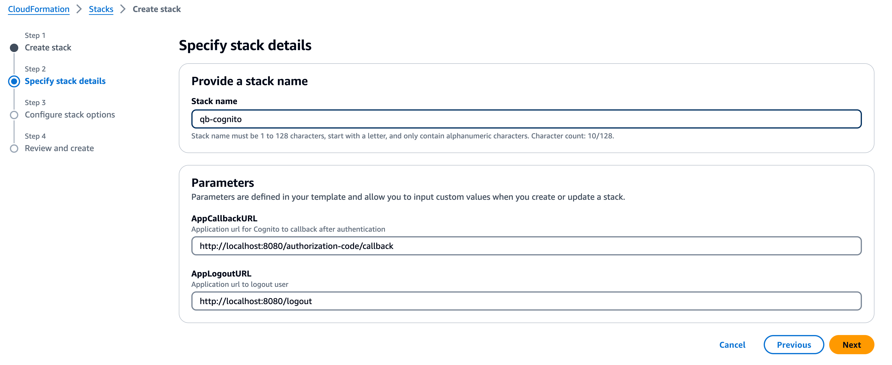

# Register web application with Amazon Cognito

To register your web application with Amazon Cognito, you need an existing user pool or must create a new one and register your application to it. You can create a new user pool and register your application using the provided CloudFormation template or the Cognito console. Alternatively, you can use the Cognito console to register your application with an existing user pool. See respective sections below for setup instructions.

For the sample web application included in this repository, use the following callback and logout urls as default. You can update domain name and port as needed later.

* **Callback URL:** `http://localhost:8080/authorization-code/callback`
* **Logout URL (Optional):** `https://localhost:8080/logout`

## Using CloudFormation template to create new user pool and register your app
1. Use CloudFormation (CFN) template [qb-api-poc-cognito.yaml](../../../cf/qb-api-poc-cognito.yaml) to deploy a new user pool and register your web application.
    * 
2. The CFN will create user pool, register a Cognito domain and register your app using following naming convention.
    * **User pool name:** `<cfn_stackname>-user-pool`
    * **Cognito domain:** `https://<cfn_stackname>-<random_number>.auth.us-east-1.amazoncognito.com`
    * **App Client Name:** `<cfn_stackname>-client`
3. Review CFN stack output and note `Client ID`, `Client Secret`, `User Pool ID` and `Issuer URL`.
    * 

## Using Cognito console to create new user pool and register your app
Follow the steps outlined below to create a user pool and register your application using Cognito console.
1. Go to the [Amazon Cognito console](https://console.aws.amazon.com/cognito/home). If prompted, enter your AWS credentials.
2. Choose the Create user pool button. You might be required to select `User Pools` from the left navigation pane to reveal this option.
3. In the top-right corner of the page, choose `Create a user pool` to start the user pool creation wizard.
4. In `Configure sign-in experience`, you can choose the identity providers (IdPs) that you will use with this user pool. For more information, see Adding user pool sign-in through a third party.
    * Under `Authentication providers`, for `Provider types`, ensure that only `Cognito user pool` is selected.
    * For `Cognito user pool sign-in options`, choose `Email`. Don't select any additional User name requirements.
    * Keep all other options as the default and choose Next.
5. In `Configure security requirements`, you can choose your password policy, multi-factor authentication (MFA) requirements, and user account recovery options. For more information, see [Using Amazon Cognito user pools security features](https://docs.aws.amazon.com/cognito/latest/developerguide/managing-security.html).
    * For `Password policy`, confirm that `Password policy mode` is set to `Cognito defaults`.
    * Under `Multi-factor authentication`, for `MFA enforcement`, choose `No MFA`. For production workloads it is strongly recommended to enable `MFA enforcement`.
    * For `User account recovery`, confirm that `Enable self-service account` recovery is not selected. For production workloads, you may want to enable this setting based on your business needs.
    * Keep all other options as the default and choose Next.
6. In `Configure sign-up experience`, you can determine how new users will verify their identities when signing up as a new user, and which attributes should be required or optional during the user sign-up flow. For more information, see [Managing users in your user pool](https://docs.aws.amazon.com/cognito/latest/developerguide/managing-users.html).
    * Confirm that `Enable self-registration` is not selected. This setting opens your user pool to sign-up from anyone on the internet. This is intended for the purposes of the example application, but apply this setting with caution in production environments.
    * Under `Cognito-assisted verification and confirmation`, verify that the `Don’t automatically send messages` check box is selected.
    * Under `Required attributes`, confirm that `email` is selected.
    * Keep all other options as the default and choose Next.
7. In `Configure message delivery`, you can configure integration with Amazon Simple Email Service and Amazon Simple Notification Service to send email and SMS messages to your users for sign-up, account confirmation, MFA, and account recovery. For more information, see [Email settings for Amazon Cognito user pools](https://docs.aws.amazon.com/cognito/latest/developerguide/user-pool-email.html) and [SMS message settings for Amazon Cognito user pools](https://docs.aws.amazon.com/cognito/latest/developerguide/user-pool-sms-settings.html).
    * For Email provider, choose `Send email with Cognito`, and use the default email sender provided by Amazon Cognito. This setting for low email volume is sufficient for application testing.
    * Keep all other options as the default and choose Next.
8. In `Integrate your app`, you can name your user pool, configure the hosted UI, and create an app client. For more information, see [Add an app client with the hosted UI](https://docs.aws.amazon.com/cognito/latest/developerguide/cognito-user-pools-configuring-app-integration.html). The example applications don't use the hosted UI.
    * Under `User pool name`, enter a `User pool name`.
    * Select `Use the Cognito hosted UI`.
    * Under `Domain`, select `Use a Cognito domain` for `Domain type`.
    * Under `Cognito domain`, Enter unique prefix name for the URL.
    * Under `Initial app client`, confirm that `App type` is set to `Confidential client`.
    * Under `Client secret`, confirm that `Generate a client secret` is selected.
    * Enter an `App client name`.
    * Under `Allowed callback URLs`, add sample applications callback URL `http://localhost:8080/authorization-code/callback`.
    * Expand `Advanced app client settings`. Confirm if `ALLOW_USER_SRP_AUTH` and `ALLOW_REFRESH_TOKEN_AUTH` are added to the list of Authentication flows.
    * Under `Allowed sign-out URLs`, click `Add sign-out URL` button and add sample applications logout URL `https://localhost:8080/logout`.
    * Keep all other options as the default and choose Next.
9. Review your choices in the `Review and create` screen and modify any selections as needed. When you're satisfied with your user pool configuration, choose `Create user pool` to proceed.
10. Navigate to newly created user pool by clicking on the user pool name.
    * Under `User pool overview`, note the `User pool ID`.
    * Next select `App integration` tab.
    * Under `App client list`, click on your app client name.
    * Under `App client information`, note `Client ID` and `Client Secret`. You might be required to toggle `Show client secret` to reveal `Client Secret`.

Remember to add sample users to the user pool. For latest documentation on creating Cognito user pool, see [Create a new user pool](https://docs.aws.amazon.com/cognito/latest/developerguide/tutorial-create-user-pool.html).

## Using Cognito console to register your app with existing user pool
1. Go to the [Amazon Cognito console](https://console.aws.amazon.com/cognito/home). If prompted, enter your AWS credentials.
2. Click on user pool name to which you want to register your application. You might be required to select `User Pools` from the left navigation pane to reveal this option.
3. Select `App integration` tab.
4. Under `App client list`, choose `Create app client`.
    * Under `App client`, confirm that `App type` is set to `Confidential client`.
    * Under `Client secret`, confirm that `Generate a client secret` is selected.
    * Enter an `App client name`.
    * Under `Authentication flows`, confirm if `ALLOW_USER_SRP_AUTH` and `ALLOW_REFRESH_TOKEN_AUTH` are listed.
    * Under `Hosted UI settings`, add sample application callback and logout URLs.
        * Under `Allowed callback URLs`, add sample applications callback URL `http://localhost:8080/authorization-code/callback`.
        * Under `Allowed sign-out URLs`, click `Add sign-out URL` button and add sample applications logout URL `https://localhost:8080/logout`.
    * Keep all other options as the default and choose `Create app client`.
10. Note the following.
    * Under `User pool overview`, note the `User pool ID`.
    * Next select `App integration` tab.
    * Under `App client list`, click on your app client name.
    * Under `App client information`, note `Client ID` and `Client Secret`. You might be required to toggle `Show client secret` to reveal `Client Secret`.
