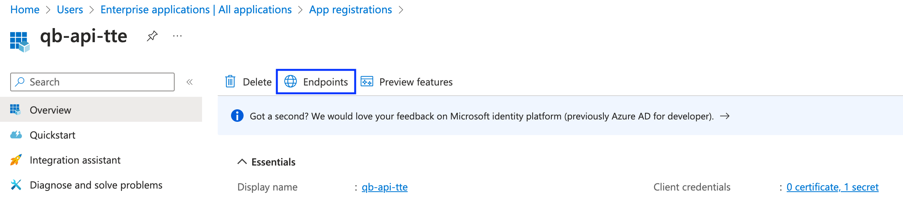

# How to find Microsoft Entra Issuer URI

You will require to know the Microsoft Entra (Entra) Issuer URI when configuring trusted identity propagation. Here are the steps to find Entra Issuer URI.

1. Navigate to [Entra Admin Center](https://entra.microsoft.com/) web console.
2. From the left navigation under `Applications` section, select `App registrations`.
3. Click on the Entra app integration for your web application.
4. Select `Overview` side menu item and click on `Endpoints` section (shown below in blue box).

5. The Entra `Issuer URI` is part of the URI in `OpenID Connect metadata document`, excluding the part `/.well-known/openid-configuration` (shown below in blue box).

