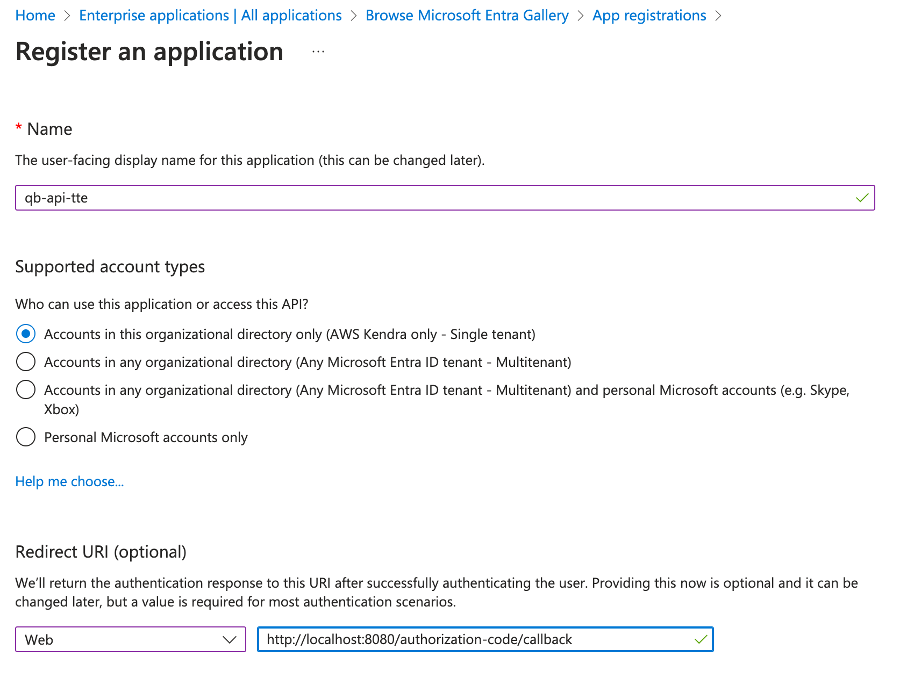
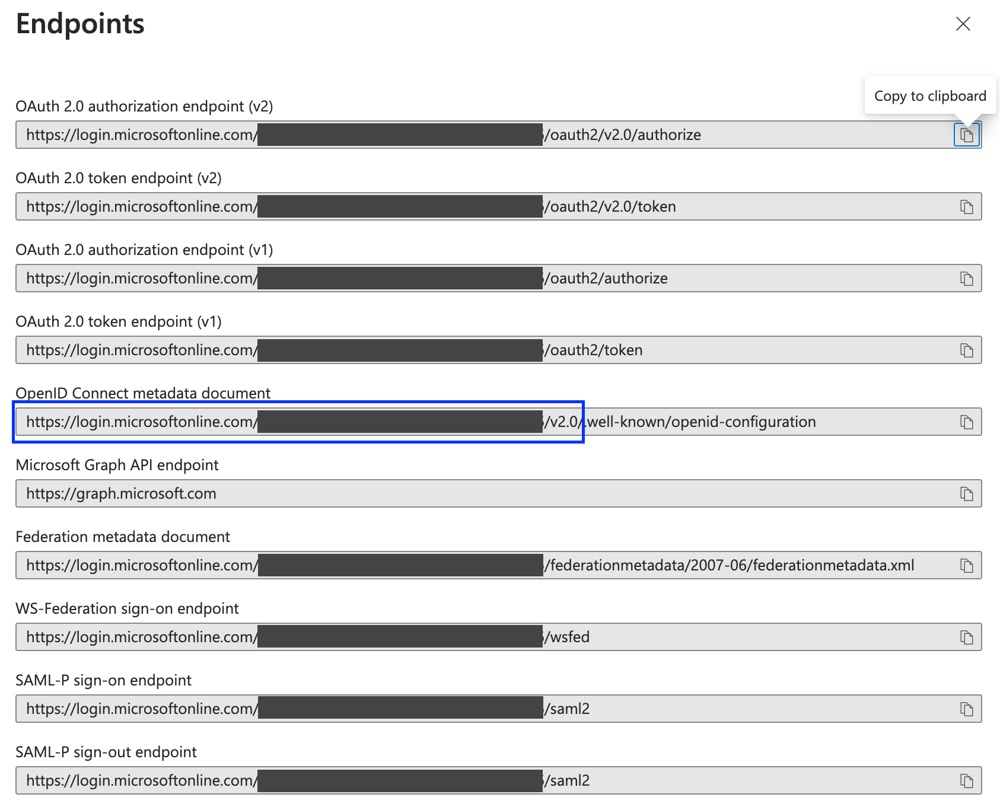
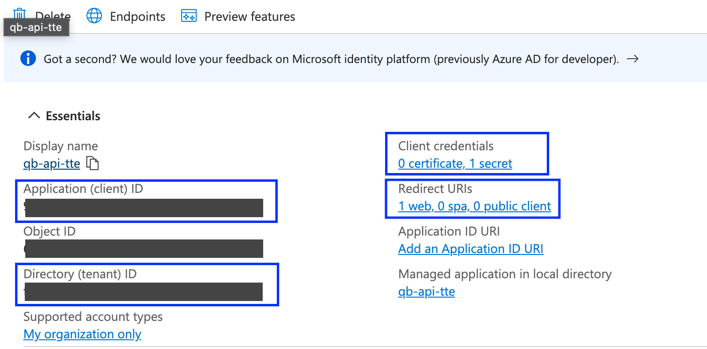
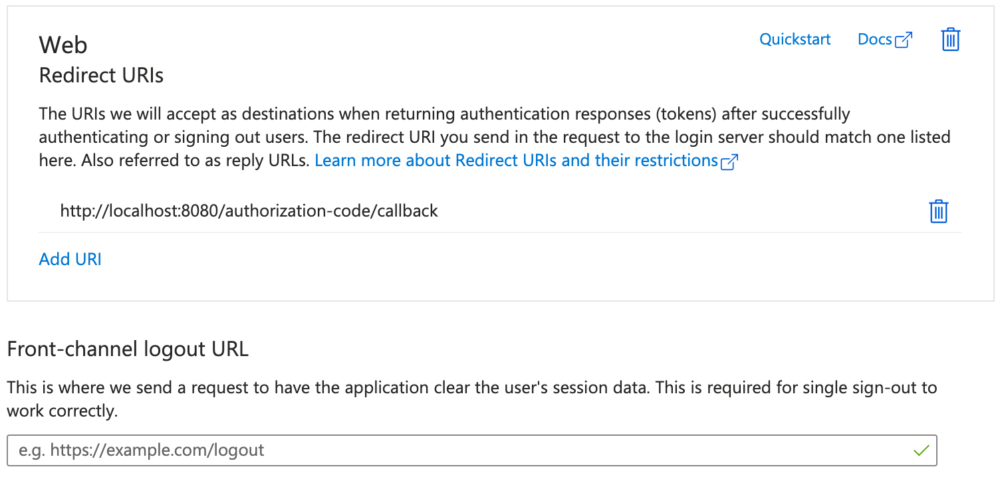

# Register web application with Microsoft Entra

Use the steps listed at [Register an application with the Microsoft identity platform](https://learn.microsoft.com/en-us/entra/identity-platform/quickstart-register-app?tabs=certificate#register-an-application) to register your web application with Microsoft Entra (Entra). For the sample web application included in this repository, use the following callback and logout urls as default. You can update domain name and port as needed later.

* **Application Type:** Web
* **Callback URL:** `http://localhost:8080/authorization-code/callback`
* **Logout URL (Optional):** Entra will accept only `https` protocol. (Example, `https://localhost:8080/logout`)

Image below illustrates web application creation configuration.

## Entra Token Issuer URI
See [How to find Microsoft Entra Issuer URI](./find-entra-issuer-url.md) to obtain the `Issuer URI` for your web application integration with Entra.

**Issuer URI format:** `https://login.microsoftonline.com/<tenant-id>/v2.0`

## Validating your web application integration with Entra
1. After registering web application integration as provided in the instructions above, navigate to [Entra Admin Center](https://entra.microsoft.com/) web console.
2. From the left navigation under `Applications` section, select `App registrations`.
3. Click on the Entra app integration for your web application.
4. Select `Overview` side menu item and expand `Essentials` section.
    * Note the `Application (client) ID` as this will be the `Client ID` and `Audience` for your web integration. Also note the `Directory (tenant) ID` as this is the application `Tenant ID` for use with issuer URI above.
    
5. From `Overview > Essentials` section, click on link for `Redirect URIs` in configured correctly as shown in image below. Logout URL is optional and can be ignored for sample web application.
    * 
