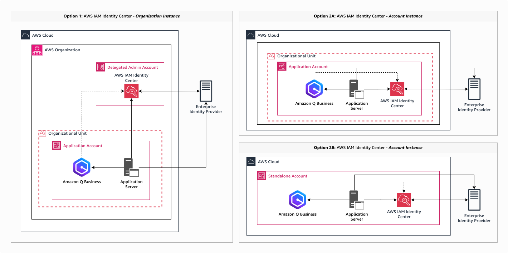
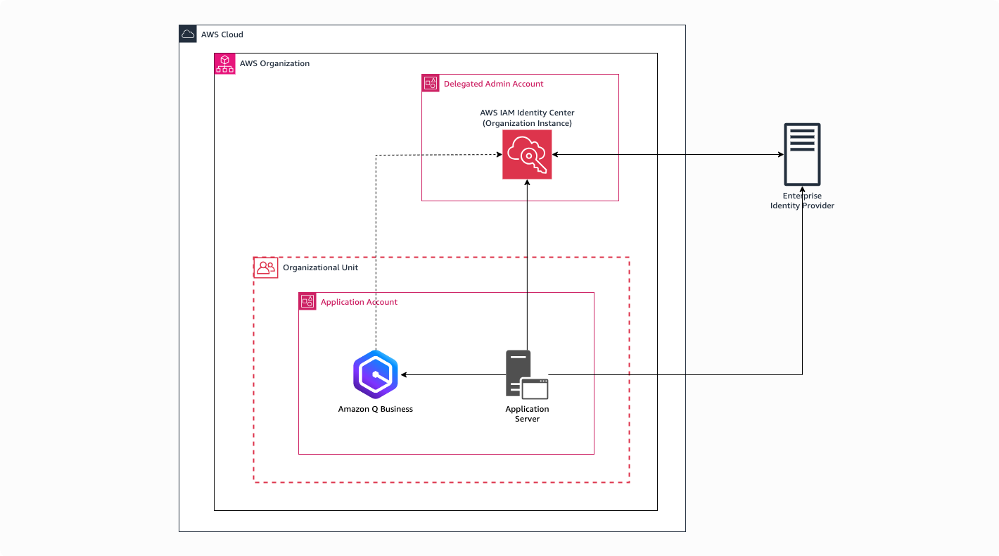
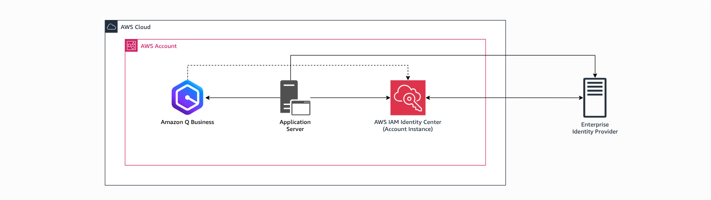

# AWS IAM Identity Center deployment options
You have multiple deployment options to choose from to install AWS IAM Identity center.

## Overview
Figure below shows various Identity Center deployment options.

* **Option 1:** Deploy a common Identity Center for your AWS Organizations in a delegated admin account.
* **Option 2:** Deploy Identity Center locally as an account level instance.
    * **Option 2a:** You can deploy Identity Center as an account level instance in a AWS Organizations member account, even if your organization has deployed Option 1. Member account instance will take precedence.
    * **Option 2b:** You can deploy Identity Center as an account level instance in a standalone AWS account.

## Organization instance
Figure below shows a closer look of Identity Center deployed in a delegated account in your AWS Organizations.

## Account instance
Figure below shows a closer look of Identity Center deployed in a standalone account.

## Additional information
For more information on Identity Center deployment refer [Manage organization and account instances of IAM Identity Center](https://docs.aws.amazon.com/singlesignon/latest/userguide/identity-center-instances.html).