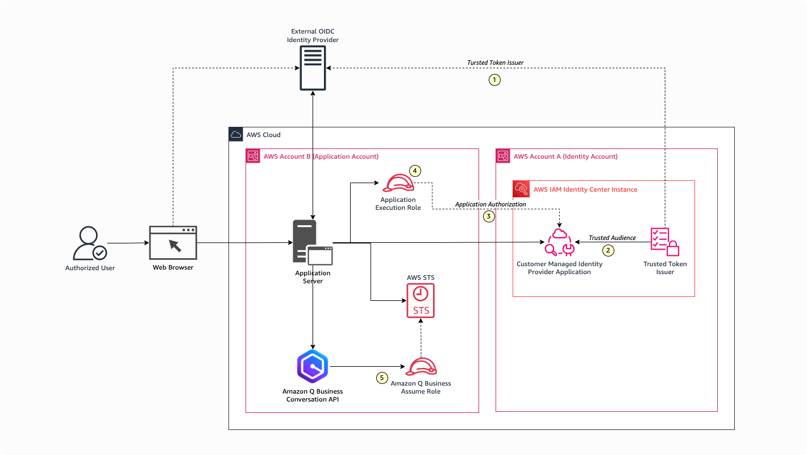
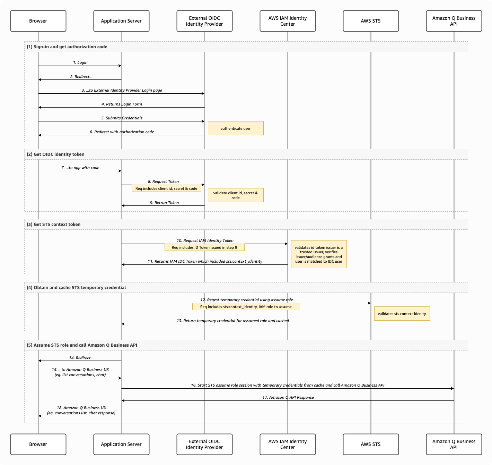

# Overview of Amazon Q Business with AWS IAM Identity Center trusted identity propagation

This sample web application demonstrates the process of obtaining authorization
from AWS IAM Identity Center (IDC) to access Amazon Q Business APIs using Python.

For enhanced security, Amazon Q Business will require user identity based 
authorization facilitated by IDC to access its APIs. In order to gain access 
to Amazon Q Business API, web applications will need to use the trusted identity 
propagation process built on [OAuth 2.0 Authorization Framework
](https://datatracker.ietf.org/doc/html/rfc6749).

## Why use trusted identity propagation?

[Trusted identity propagation](https://docs.aws.amazon.com/singlesignon/latest/userguide/trustedidentitypropagation-overview.html) provides a mechanism that enables applications that authenticate outside of AWS to make requests on behalf of their users with the use of a trusted token issuer. Consider a client-server application that is using an external identity provider to authenticate a user to provide access to an AWS resource that is private to the user. For example, your web application may use Okta as an external identity provider (IdP) to authenticate a user to view their private conversations from Q Business. In this scenario, Q Business is unable to use the identity token generated by third party provider to provide direct access to the user’s private data, since there is no mechanism to trust the identity token issued by the third party.

To solve this, IAM Identity Center allows you to get the human identity from your external identity provider into an IAM role session, to allow you to authorize requests base on the human, their attributes, and their group memberships, rather than do fine-grained permissions in IAM policy. You can exchange the token issued by the external identity provider for a token that is generated by IAM Identity Center. The token that is generated by IAM Identity Center refers to the corresponding IAM Identity Center user. The web application can now use the new token to initiate a request to Q Business for the private chat conversation. Because the new token references the corresponding user in IAM Identity Center, Q Business can authorize the requested access to the private conversation based on the user or their group membership as represented in IAM Identity Center.

Some of the benefits of using trusted identity propagation are:

* Prevents user impersonation and protect against unauthorized access to user private data by spoofing user identity.
* Facilitates auditability and fosters responsible use of resource as Q Business automatically logs API invocations to AWS CloudTrail along with user identity.
* Promotes software design principle rooted in user privacy, important for legal and compliance requirements.

## Overview of trusted identity propagation deployment

Deployment of trusted identity propagation involves 5 steps. As a best practice, it is recommended the security owner manages IDC updates and application owner manages application updates, providing clear separation of duties. A Security Owner is responsible for administrating the IAM Identity Center of an Organization, or account. An Application Owner is responsible for creating an application on AWS.

1. Security owner adds the external OIDC identity provider’s (IdP) issuer URL to IDC instance’s Trusted Token Issuer. It is important the issuer URL matches iss claim attribute present in the JWT identity token generated by the IdP after user authentication as shown in Code-1 snippet below. This is configured once for a given issuer URL.
2. Security owner creates a Customer Managed Identity Provider Application in AWS IAM Identity Center and explicitly configures the specific audience for a given trusted token issuer is being authorized to perform token exchange via IDC. Since there could be more than one application (or audience) for which the external IdP could be authenticating users, explicitly specifying audience helps prevent unauthorized application from using the token exchange process. It is important the audience ID configured matches the aud claim attribute present in the JWT identity token generated by the IdP after user authentication as shown in Code-1 snippet below.
3. Security owner edits the application policy for the Customer Managed Provider Application created in the previous step to add/update the IAM execution role used by the application server/AWS Lambda. This prevents any unapproved user or application from invoking the CreateTokenWithIAM API on IDC to initiate the token exchange.
4. Application owner creates and add IAM Policy to the application execution role to allow the application to invoke CreateTokenWithIAM API on the AWS Identity Center to perform token exchange and to create temporary credentials using STS services.
5. Application owner creates IAM Role with policy allowing access to Q Business Conversation API for use with STS service to create a temporary credentials to invoke Q Business APIs.

> **Important**  
> Choosing to add a trusted token issuer is a security decision that requires careful consideration. Only choose trusted token issuers to perform the following tasks:  
> 1. Authenticate the user who is specified in the token. Control the audience claim, and claim you configure as the user identifier.  
> 2. Generate a token that IAM Identity Center can exchange for an IAM Identity Center created token. Control the IAM Identity Center Customer Managed Application policy to add only IAM users, roles and execution roles that can perform the exchange

## Authorization flow

For a typical web application, the Trusted identity propagation process will involve 5 steps as shown in flow diagram.

1. Sign-in and obtain authorization code from Identity Provider (IdP)
2. Use the authorization code and client secret to retrieve identity token from IDP
3. Exchange IdP Identity token with IAM Identity Center (IDC) STS context identity
4. Use IDC STS context identity to obtain temporary access credentials from AWS STS service
5. Use temporary access credentials to access Q Business APIs

The complete sequence of operations along with various actors is illustrated in the diagram below:

## References
* [AWS IDC trusted identity propagation](https://docs.aws.amazon.com/singlesignon/latest/userguide/trustedidentitypropagation.html)
* [Making authenticated Amazon Q Business API calls using IAM Identity Center](https://docs.aws.amazon.com/amazonq/latest/qbusiness-ug/making-sigv4-authenticated-api-calls.html)
* [OAuth 2.0 Authorization Framework](https://datatracker.ietf.org/doc/html/rfc6749)
* [OpenID Connect for Verifiable Credential Issuance](https://openid.net/specs/openid-connect-4-verifiable-credential-issuance-1_0-05.html)
* [How to develop a user-facing data application with IAM Identity Center and S3 Access Grants](https://aws.amazon.com/blogs/storage/how-to-develop-a-user-facing-data-application-with-iam-identity-center-and-s3-access-grants/)
* [How to develop a user-facing data application with IAM Identity Center and S3 Access Grants (Part 2)](https://aws.amazon.com/blogs/storage/how-to-develop-a-user-facing-data-application-with-iam-identity-center-and-s3-access-grants-part-2/)
* [Implement authorization by grant type](https://developer.okta.com/docs/guides/implement-grant-type/authcode/main/#1-setting-up-your-application)