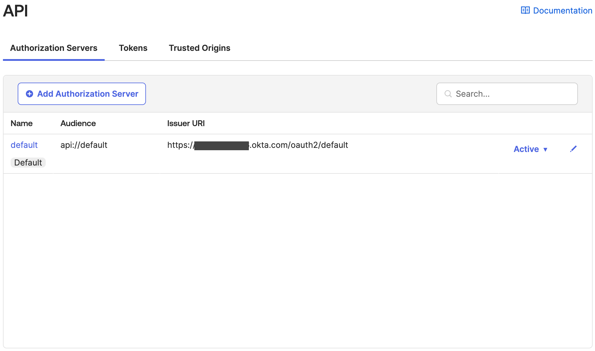

# How to find Okta authorization servers Issuer URI

You will require to know the Okta issuer URI when configuring trusted identity propagation. Here are the steps to find Okta authorization servers Issuer URI.

1. Navigate to Okta Admin web console.
2. Verify if your application is using default issuer.
    * From the left navigation select `Applications` under `Applications` section.
    * Click on the Okta integration for your web application.
    * Select `Sign On` tab and scroll down to `OpenID Connect ID Token` section.
    * If the `Issuer` is set to `Dynamic`, your app is using `default issuer URI` as show in the image below.

3. To find the `default issuer URI`, from the left navigation select `API` under `Security` section.
    * The `default issuer URI` is listed under `Authorization Servers` tab as show in the image below.
    
