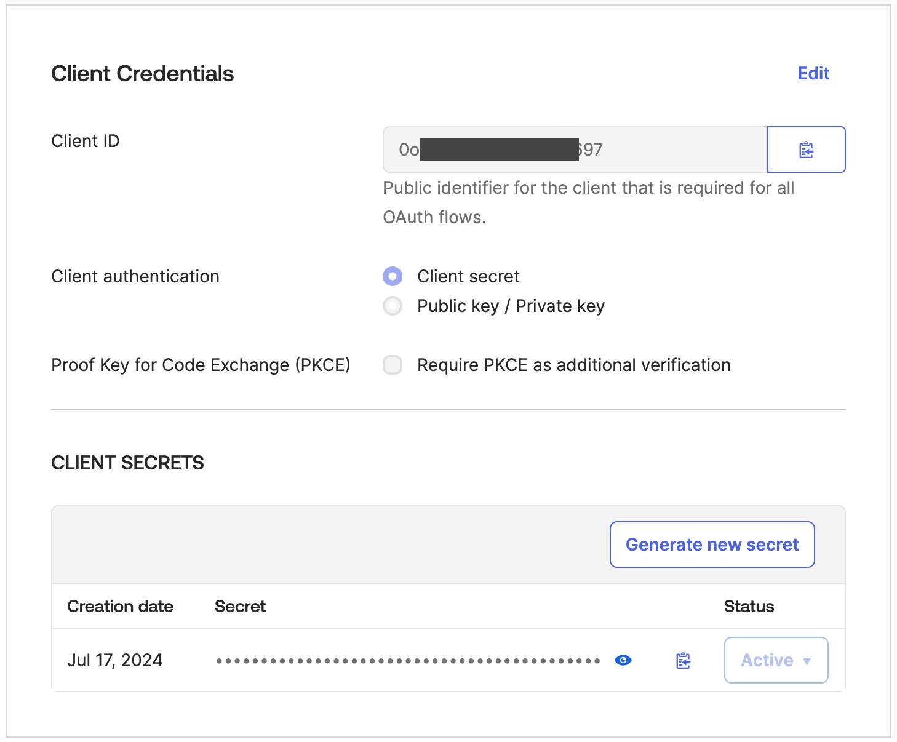

# Register web application with Okta

Use the steps listed by [Create an OIDC Web App in the Okta Admin Console](https://support.okta.com/help/s/article/create-an-oidc-web-app-in-dashboard?language=en_US) to register your application. For the sample web application included in this repository, use the following callback and logout urls as default. You can update domain name and port as needed later.

* **Callback URL:** `http://localhost:8080/authorization-code/callback`
* **Logout URL:** `http://localhost:8080/logout`

Image below illustrates web application creation configuration.

## Okta Token Issuer URI
See [How to find Okta authorization servers Issuer URI](./find-okta-issuer-url.md) to obtain the `Issuer URI` for your web application integration with Okta.

**Issuer URI format:** `https://<okta_domain>/oauth2/default`

## Validating your web application integration with Okta
1. After creating web application integration as provided in the instructions above, navigate to Okta Admin web console.
2. From the left navigation select `Applications` under `Applications` section.
3. Click on the Okta integration for your web application.
4. Select `General tab`.
    * From the `Client Credentials` section, note the `Client id` and `Client Secret` (generate new, if required).
    
    * From the `General settings > LOGIN` section, verify if the callback and logout URL are configured correctly as shown in image below.
    
5. Select `Sign On` tab.
    * From the `OpenID Connect ID Token` section, note the `Audience` value. By default, the `Audience` and `Client ID` are same. See image below.
    * See [How to find Okta authorization servers Issuer URI](./find-okta-issuer-url.md) to obtain the `Issuer URI` for your web application integration with Okta.
    
